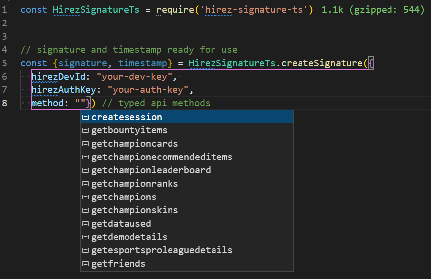

## About

hirez-signature-api is a helper for [Smite/Paladins/RealmRoyal api](https://webcdn.hirezstudios.com/hirez-studios/legal/smite-api-developer-guide.pdf).

## Usage

Using npm:

```bash
$ npm install hirez-signate-ts
```

Using yarn:

```bash
$ yarn add hirez-signate-ts
```

## Example


